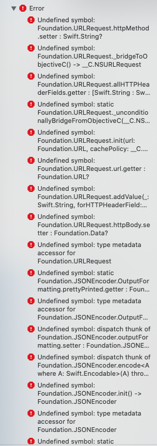

# react-native-crisp-chat-sdk

React-Native bridge for Crisp chat iOS and Android SDK&#39;s


## Features

- iOS & Android Support (In beta)
- Typescript Support

## Installation

Install the library using either yarn or npm like so:

```sh
yarn add react-native-crisp-chat-sdk
```

```sh
npm install --save react-native-crisp-chat-sdk
```

### iOS Installation

If you're using React Native versions > 60.0, it's relatively straightforward.

```sh
cd ios && pod install
```

For versions below 0.60.0, use rnpm links

- Run `react-native link react-native-crisp-chat-sdk`
- If linking fails, follow the
  [manual linking steps](https://facebook.github.io/react-native/docs/linking-libraries-ios.html#manual-linking)

### iOS

Start using Crisp by adding the following code on your AppDelegate :

```objective-c
@import Crisp;

[[CrispMain alloc] initializeWithWebsiteId:@"YOUR_WEBSITE_ID"];
```

#### Additional Steps

This library was written in Swift, so in-order for you app to compile, you need to have at least on .swift file in your source code a bridging header to avoid a runtime error like so:



All you have to do is:

- File > New > File
- Swift File
- Name the file whatever you wish
- When prompted to create a bridging header, do so

### Android

Initialize the library in your [Application subclass] (MainApplication.java)
```java
import im.crisp.sdk.Crisp;

public class MainApplication extends Application implements ReactApplication {

    @Override
    public void onCreate() {
        super.onCreate();

        Crisp.initialize(this);
        // Replace it with your WEBSITE_ID
        // Retrieve it using https://app.crisp.chat/website/[YOUR_WEBSITE_ID]/
        Crisp.getInstance().setWebsiteId("7598bf86-9ebb-46bc-8c61-be8929bbf93d");
    }
}
```

## Requirements

⚠️ Adding Camera and Photo permissions is mandatory, `NSCameraUsageDescription` and `NSPhotoLibraryUsageDescription` in  `Info.plist`, to inform your users that you need to access to the Camera and Photo Library. You also have to enable **"iCloud Documents"** capability

## Get your website ID

Your website ID can be found in the Crisp App URL:

- https://app.crisp.chat/website/[WEBISTE_ID]/inbox/

Crisp Website ID is an UUID like e30a04ee-f81c-4935-b8d8-5fa55831b1c0

## Usage

You can view the [example project](./example/src/App.tsx) for more usage.

```js
import { CrispChatSDK, CrispChatUI } from 'react-native-crisp-chat-sdk';

// ...

CrispChatSDK.setEmail('test@test.com')

<CrispChatUI style={{ flex: 1, width: '100%' }} />
```

## Availables APIs:
* `CrispChatSDK.setEmail('test@test.com')`

## Contributing

See the [contributing guide](CONTRIBUTING.md) to learn how to contribute to the repository and the development workflow.

## License

MIT
